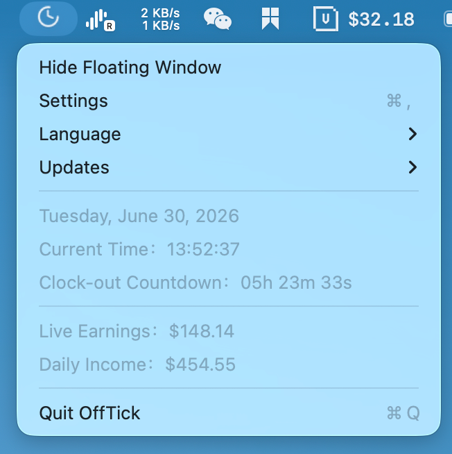
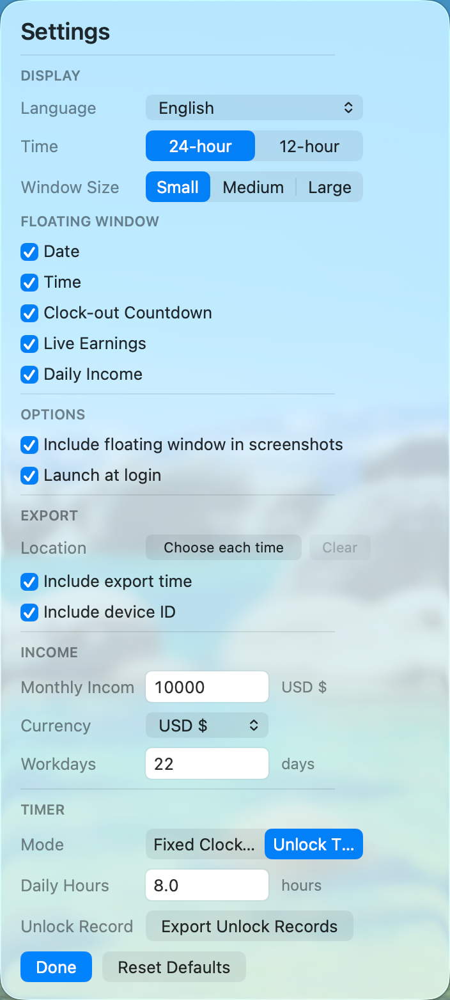

# OffTick

OffTick is a lightweight macOS menu bar app that keeps a floating workday timer on screen. It shows the current date and time, counts down to clock-out, and can estimate live earnings for the day.

<p>
  
  
  
</p>

中文说明见下方：[简体中文](#简体中文)。

Icon note: the official app icon will be provided later.

## English

### Features

- Menu bar app: show or hide the floating window, open settings, switch language, and quit from the menu bar.
- Floating window: always-on-top, movable, screenshot-friendly, and available in small, medium, and large sizes.
- Custom floating content: independently toggle date, time, clock-out countdown, live earnings, and daily income.
- Screenshot control: choose whether the floating window should appear in screenshots.
- Launch at login: enable OffTick from settings so it starts automatically after login. This requires macOS 13 or later.
- Update checks: OffTick can check GitHub Releases and open the latest release page when a newer version is available.
- Time and calendar: supports 24-hour and 12-hour time, plus Gregorian and Chinese lunar calendar display.
- Workday calculation: supports a fixed clock-out time or a timer based on the first unlock after 5 AM.
- Earnings calculation: set monthly income and workdays in the current month to calculate daily income and live earnings.
- Unlock records export: records the first unlock after 5 AM in unlock-timer mode and exports selected date ranges to a watermarked PDF. Export time and device information can be toggled in the watermark settings.
- Network time sync: calibrates time from the network and refreshes the floating window and menu data every second.
- Clock-out reminder: sends a system notification when work is done and shows a small celebration animation when the floating window is visible.
- Local persistence: saves salary, workdays, display options, language, timer mode, floating window size, screenshot behavior, and other preferences locally.
- Single-instance behavior: prevents duplicate OffTick instances from running at the same time.
- Menu bar compatibility: uses a stable Bundle ID and status item autosave name to reduce duplicate OffTick entries in system settings.
- Languages: Simplified Chinese, Traditional Chinese, English, Japanese, Korean, Spanish, French, German, Portuguese, and Russian.

### Requirements

- macOS 12 or later
- macOS 13 or later for launch at login
- Swift 5.9 or later for local builds

### Build From Source

```bash
swift build
.build/debug/OffTick
```

### Build The App Bundle

```bash
./Scripts/build-app.sh
open .build/OffTick.app
```

For normal use, launch OffTick through the `.app` bundle. The script writes a stable Bundle ID, generates `Info.plist`, and signs the app locally.

### Local Test Package

```bash
./Scripts/package-local.sh
```

The script creates:

- `dist/OffTick-0.1.2.zip`
- `dist/OffTick-0.1.2.zip.sha256`
- `dist/RELEASE_NOTES-0.1.2.md`

This package is locally signed but not notarized by Apple. On first launch, macOS may require opening the app with Control-click > Open, or approving it in System Settings > Privacy & Security.

### GitHub Release Checklist

1. Upload `OffTick-0.1.2.zip` to the GitHub Release.
2. Paste the generated SHA256 value from `OffTick-0.1.2.zip.sha256`.
3. Paste the generated release notes from `RELEASE_NOTES-0.1.2.md`.
4. Clearly state that the build is locally signed and not notarized by Apple.

GitHub Release asset download counts can be used as a rough, privacy-friendly usage signal. OffTick does not include hidden analytics telemetry.

### License

OffTick is released under the MIT License.

## 简体中文

OffTick 是一个轻量 macOS 菜单栏小工具，用置顶悬浮窗显示日期、时间、下班倒计时和收入进度。

图标说明：正式图标稍后提供。

### 功能

- 菜单栏入口：可显示/隐藏悬浮窗、打开设置、切换语言和退出应用。
- 悬浮窗：置顶、可拖动、可选择小/中/大尺寸，并可控制是否出现在截图中。
- 自定义显示内容：日期、时间、下班倒计时、今日实时收入、日均收入都可以单独开关。
- 截图控制：可选择截图时是否包含悬浮窗。
- 开机自启动：可在设置中开启登录后自动启动，需 macOS 13 或更高版本。
- 更新检查：可从 GitHub Releases 检查新版本，发现更新时打开最新 Release 页面。
- 时间与日历：支持 24 小时/12 小时制，以及国历/农历显示。
- 下班计算：支持固定下班时间，也支持按当天 5 点后首次解锁开始计时。
- 收入计算：可设置月薪和本月工作日，自动计算日均收入和今日实时收入。
- 解锁记录导出：选择“解锁计时”后，会记录每天 5 点后的首次解锁时间，并可按日期范围导出带水印的 PDF；水印中的导出时间和设备信息可在设置中开关。
- 网络时间：启动后校准网络时间，并每秒刷新悬浮窗与菜单中的实时数据。
- 下班提醒：到达下班时间时发送系统通知；悬浮窗可见时显示庆祝动画。
- 设置持久化：月薪、工作日、显示项、语言、计时模式、悬浮窗大小、截图行为等配置会保存到本机用户设置中。
- 单实例运行：重复启动时会自动退出新实例，避免开多个 OffTick。
- 菜单栏兼容：使用稳定的 Bundle ID 和状态栏 autosaveName，减少系统设置中出现重复 OffTick 的概率。
- 多语言：支持简体中文、繁体中文、英语、日语、韩语、西班牙语、法语、德语、葡萄牙语和俄语。

### 系统要求

- macOS 12 或更高版本
- 开机自启动功能需要 macOS 13 或更高版本
- 本地构建需要 Swift 5.9 或更高版本

### 从源码运行

```bash
swift build
.build/debug/OffTick
```

### 构建 App

```bash
./Scripts/build-app.sh
open .build/OffTick.app
```

日常使用建议通过 `.app` 启动。脚本会写入稳定的 Bundle ID，生成 `Info.plist`，并对 App 做本地签名。

### 本地测试分发

```bash
./Scripts/package-local.sh
```

脚本会生成：

- `dist/OffTick-0.1.2.zip`
- `dist/OffTick-0.1.2.zip.sha256`
- `dist/RELEASE_NOTES-0.1.2.md`

这是本地签名但未经过 Apple 公证的测试包，适合小范围试用。第一次打开时，macOS 可能需要按住 Control 键点击 App 后选择“打开”，或到“系统设置 > 隐私与安全性”里点击“仍要打开”。

### GitHub Release 发布清单

1. 上传 `OffTick-0.1.2.zip` 到 GitHub Release。
2. 把 `OffTick-0.1.2.zip.sha256` 里的 SHA256 值贴到 Release notes。
3. 把 `RELEASE_NOTES-0.1.2.md` 里的说明贴到 Release notes。
4. 明确说明这是本地签名、未经过 Apple 公证的测试版。

GitHub Release 的资源下载次数可以作为粗略、隐私友好的使用量参考。OffTick 不包含隐藏的数据埋点。

### 许可证

OffTick 使用 MIT License 开源。
